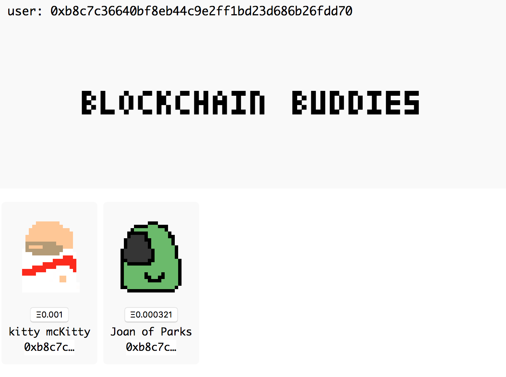
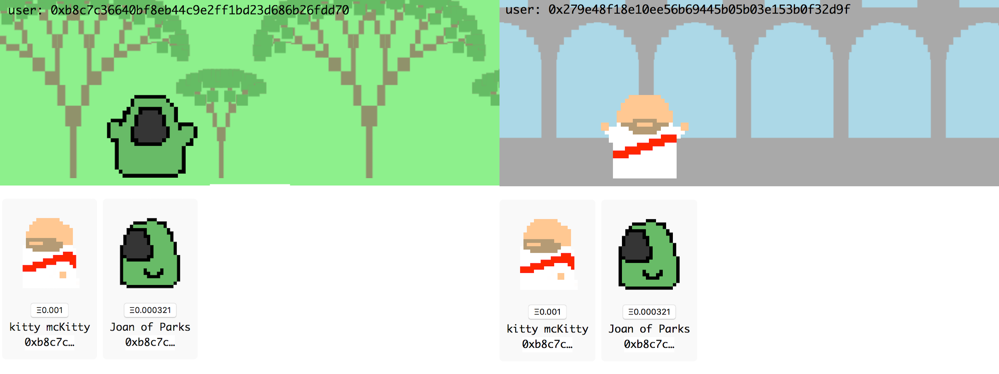

# Blockchain Buddies

is a demo repo for a [crypto-collectible](https://www.cryptokitties.co) marketplace build with [Solidity](https://solidity.readthedocs.io) which walks through a few basic ways of interacting with a smart contract in a testing environment on the command line and the web.

## prereqs

- node v8.9.4 or higher
- [Metamask](https://metamask.io) extension for either Firefox or Chrome
  - [links here]
- these globally installed packages
  - [truffle](https://truffleframework.com) (`$ npm install -g truffle@4.1.11`)
  - [yarn](https://yarnpkg.com/en/) (`$ brew yarn`)
  - [parcel](https://parceljs.org/) (`npm install -g parcel-bundler@1.9.3`)
  - [npx](https://www.npmjs.com/package/npx) (`$ npm i -g npx`)

## getting started

This project manages its dependencies with [yarn](https://yarnpkg.com/en/docs/usage).

`$ yarn` or `$ yarn install`


### start ganache (local blochchain)

In a designated terminal window let's initialize a local test blockchain with ganache.

`$ npm run ganache`

You should see something similiar to the following:

```
Available Accounts
==================
(0) 0x279e... (~100 ETH)
(1) 0xb8c7... (~100 ETH)
...

Private Keys
==================
(0) 0x6d24...
(1) 0x895f...
...

HD Wallet
==================
Mnemonic:      divorce wealth ... move diesel

Listening on 127.0.0.1:8545
eth_getBlockByNumber
net_version
net_version
eth_getBlockByNumber
...
```

### connect to ganache with Metamask

Now that a local blockchain network exists Metamask has something to connect to. Open up Metamask, choose `Localhost 8545` from the network tab at the top. Once it has connect you'll need to import the fake wallet the ganache generates. Choose `import from mneumonic` and enter the 10 word mneumonic provided by ganache above and any password.

You start with account `0` already recognized but add at least one more from the account list by choosing `import account from private key` and then enter any of the other private keys that ganache provides above.

Wonderful. We should now have at least 2 test Ethereum accounts that Metamask recognizes and can toggle between. So far so good.

### migrate contract with truffle

Smart contracts must be compiled to an Ethereum VM JSON file. In its own terminal window run:

`$ truffle compile`

Successful output:

```
Compiling ./contracts/NFCB.sol...
Writing artifacts to ./build/contracts
```

Once the contract is compiled it needs to be migrated to the blockchain.

`$ npm run migrate`

Sometimes this errors out. Either try the above command again or

`$npm run remigrate`

If it hangs, open Metamask and see if it is trying to find the network. Not sure what this is about but wait until it connects again to check on the migration status (It can sometimes take a minute or two).

## interacting with contract

### truffle

Let's add a cryptocollectible to our marketplace which is currently empty. We're gonna mint a new Blockchain Buddy ([erc-721](http://erc721.org) inspired token) with truffle.

In a new terminal window run `$ truffle console`. Let's mint a new character called "kitty McKitty" costing 0.001 Ether:

`truffle(development)> NFCB.deployed().then(instance => { instance.mint("kitty mcKitty", web3.toWei(0.001))})`

If no error message shows up you successfully minted your first cryptocollectible!

Let's prove to ourselves it worked:
```
truffle(development)> NFCB.deployed().then(instance => { instance.tokenMap.call(0).then(console.log) })

[ '0x6b69747479206d634b69747479000000',
  BigNumber { s: 1, e: 15, c: [ 10 ] },
  true ]

truffle(development)> web3.toAscii('0x6b69747479206d634b69747479000000')
'kitty mcKitty\u0000\u0000\u0000'
```
And 0.001 Ether is 1x10^15 wei so the price is correct too! Let's check who owns this token:

```
truffle(development)> NFCB.deployed().then(instance => { instance.tokenMap.call(0).then(instance.ownerOf.call(0).then(console.log))})

0x279e48f18e10ee56b69445b05b03e153b0f32d9f

truffle(development)> web3.eth.accounts[0]

0x279e48f18e10ee56b69445b05b03e153b0f32d9f
```
Cool. From the above we can see that when truffle migrated the contract to ganache it made account 0 the CEO and the account used to minted a new Blockchain Buddy. Let's have account 1 buy that token from the CEO.

```
truffle(development)> NFCB.deployed().then(instance => { instance.buy(0, {from: web3.eth.accounts[1], value: web3.toWei(0.005)} )})

truffle(development)> NFCB.deployed().then(instance => { instance.tokenMap.call(0).then(instance.ownerOf.call(0).then(console.log))})

0xb8c7c36640bf8eb44c9e2ff1bd23d686b26fdd70

truffle(development)> web3.eth.accounts[1]

'0xb8c7c36640bf8eb44c9e2ff1bd23d686b26fdd7
```
Amazing! Account 1 just purchased the Blockchain Buddy #0 from the CEO.

## web client

From a new terminal window run:

`$ npm start`

The cryptocollectible marketplace should be viewable via `http://127.0.0.1:1234`.



One should be able to purchase Buddies by clicking on the buy buttons beneath their icons. Metamask should open a popup confirming the transaction. You might have pop-ups blocks in which case  you might need to click on the Metamask extension icon to verify the transaction.

**LICENCE**

This project is licensed under the terms of the [MIT](https://opensource.org/licenses/MIT) license. Copyright © 2018 Jake Wood
